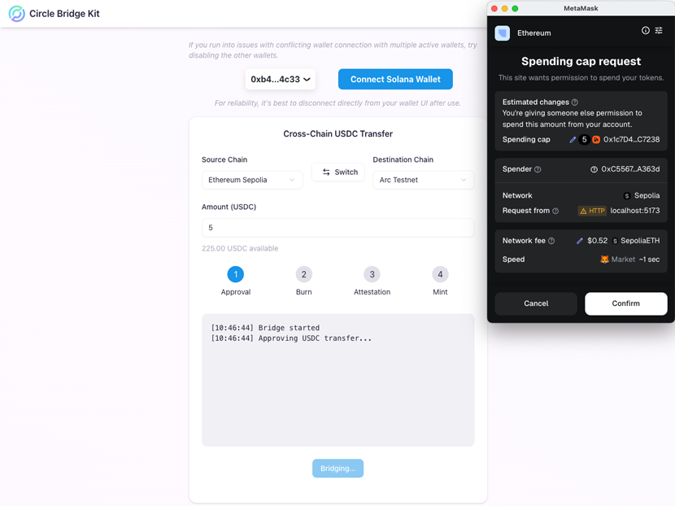

# Circle Bridge Kit Transfer

This sample app demonstrates how to use Circle's [Bridge Kit](https://www.npmjs.com/package/@circle-fin/bridge-kit) to transfer USDC across chains with a wallet-connect experience for both EVM and Solana testnets.



## Prerequisites

- Node.js 18+ (recommended LTS) and npm
- An EVM wallet (e.g., MetaMask) and a Solana wallet (e.g., Phantom)
- Testnet USDC on the relevant chains and native tokens for gas fees

## Getting Started

1. Install dependencies:

    ```bash
    npm install
    ```

2. Start the app in development:

    ```bash
    npm run dev
    ```

This runs both:
- Client (Vite) on `http://localhost:5173`
- Preview server (Hono) on `http://localhost:8787`

The Vite dev server proxies `/api` to the preview server per `vite.config.ts`.

3. Build for deployment:

    ```bash
    npm run build
    ```

Outputs static assets to `dist/` and type-checks the project.

4. Preview the deployment build locally:

    ```bash
    npm run preview
    ```

Serves `dist/` using the Hono server on `http://localhost:8787`.

## How It Works

- Supported chains are fetched from Bridge Kit at runtime and mapped to Wagmi in `src/lib/wagmiConfig.ts` and `src/lib/mapChains.ts`.
- Wallet wiring:
  - `useEvmAdapter` builds a Bridge Kit EVM adapter from the active Wagmi connector provider.
  - `useSolanaWallet` connects to `window.solana` and builds a Solana adapter.
- The main flow is in `src/App.tsx`:
  - Pick source and destination chains (testnets), enter USDC amount, connect wallets.
  - On submit, we optionally switch the EVM network, then call `useBridge().bridge(...)`.
  - Bridge Kit emits events; the UI updates progress and logs.
  - On success, balances refresh and success UI appears.
- USDC balances are queried via Bridge Kit actions (`usdc.balanceOf`) in `src/hooks/useUsdcBalance.ts`.

## File Highlights

- `src/App.tsx`: Main UI and bridging flow
- `src/lib/wagmiConfig.ts`: Dynamically builds Wagmi config from Bridge Kit chains
- `src/lib/mapChains.ts`: Maps Bridge Kit chain metadata to Wagmi `Chain`
- `src/hooks/useBridge.ts`: Thin wrapper around `BridgeKit().bridge(...)` with event handling
- `src/hooks/useEvmAdapter.ts`: Creates EVM adapter from Wagmi provider
- `src/hooks/useSolanaWallet.ts`: Connects Solana wallet and creates adapter
- `src/hooks/useUsdcBalance.ts`: Reads USDC balances per chain
- `api/server.ts`: Hono server to serve the built app (`dist/`)

## Usage Notes

- This sample is scoped to testnets (filters Bridge Kit chains by `isTestnet === true`).
- If multiple EVM providers are present (e.g., Phantom EVM + MetaMask), the app attempts a sane default; you can switch via the wallet UI.
- If wallet network switching is rejected, the bridging flow will skip and you can try again.
- After use, disconnecting directly from your wallet UI can improve reliability between sessions.

## Scripts

- `npm run dev`: Run preview server and Vite dev server concurrently
- `npm run dev:server`: Start the Hono preview server with live reload
- `npm run dev:client`: Start Vite dev server
- `npm run build`: Build static assets and run type-checking
- `npm run preview`: Serve `dist/` via Hono server

## Security

See `SECURITY.md` for vulnerability reporting guidelines. Please report issues privately via Circle's bug bounty program.

## License

[](https://github.com/circlefin/circle-bridge-kit-transfer/blob/master/LICENSE)
